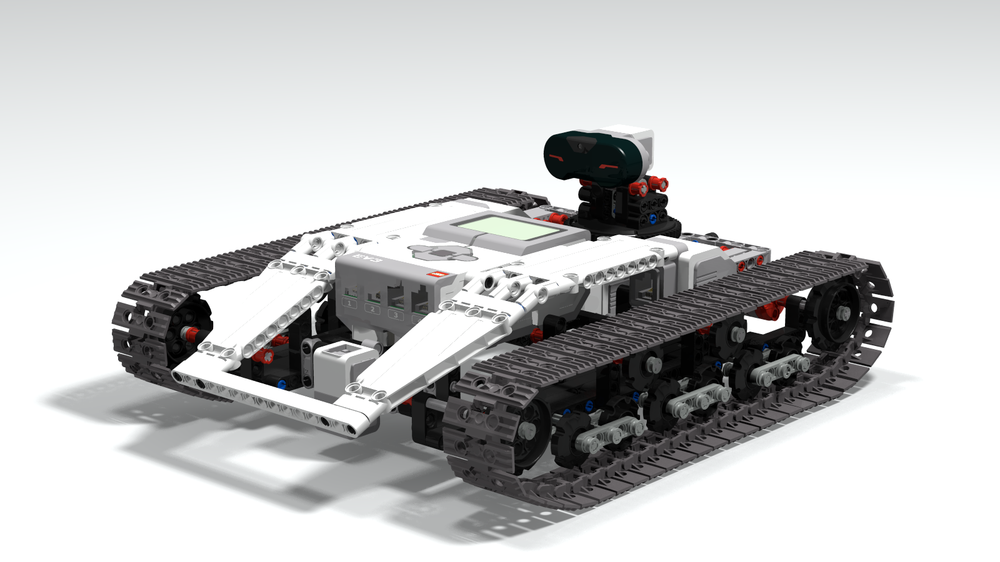

# Ev3Remoted
Ev3Remoted is a library for Lego Mindstorms Ev3 robots running ev3dev with Python bindings; it allows remote control of the robot via UDP/IP protocol from a remote desktop application.

This repository comes with a working example to remote control the **Ev3 Tracked Explorer**.  The Ev3 Tracked Explorer is a tracked rover equipped with a Ev3 Infrared sensor which can be rotated by an Ev3 Medium motor. It features a surrounding continuous scan to detect eventual obstacles.

Have a look at the [Smallrobots.it](https://www.smallrobots.it/ev3-tracked-explor3r/) blog for details.

